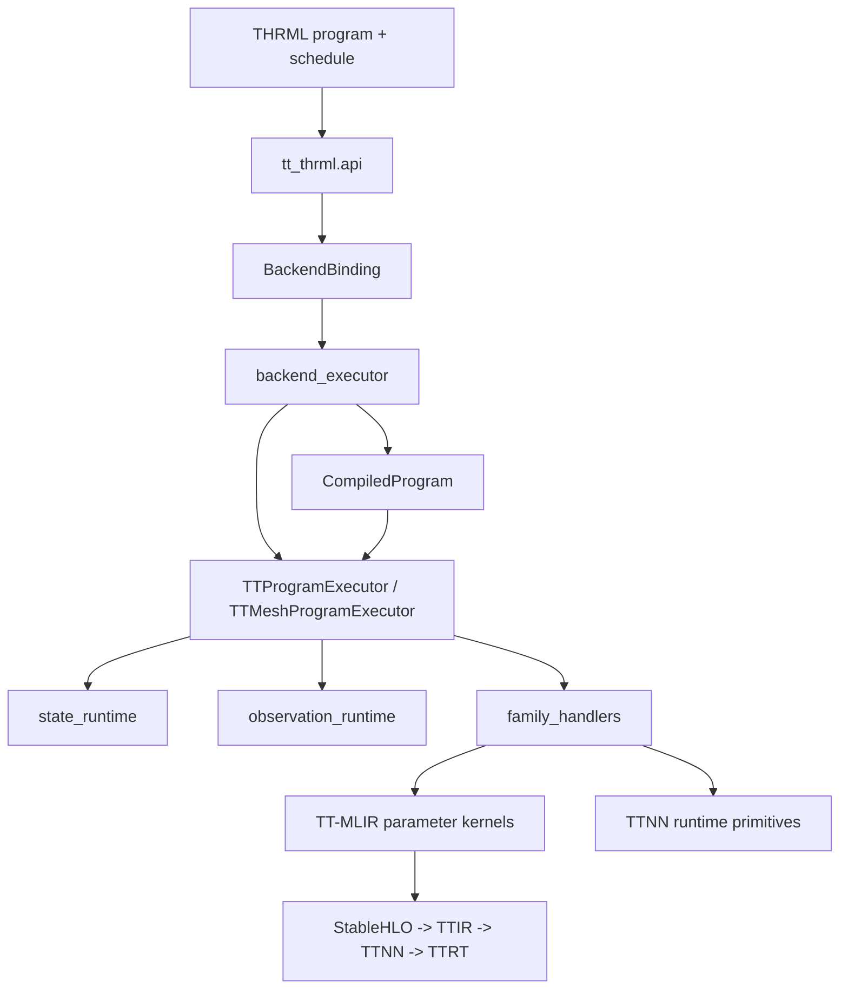
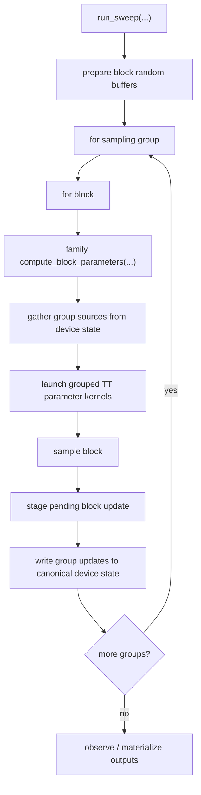

# TT-THRML Internals

`tt-thrml` has one simple boundary:

- upstream `thrml` owns program authoring
- `tt-thrml` owns Tenstorrent execution

The executor keeps canonical block state on device, compiles TT-shaped metadata once, and routes parameter-family math through TT-MLIR-backed kernels.

## Architecture

## Sweep Flow

## Parameter-Kernel Boundary

The parameter-kernel layer is the main TT-MLIR boundary.

- The compiler emits a `CompiledBlockParameterPayload` for every block.
- Every dynamic term is represented as a `CompiledInteractionGroup`, including singleton terms.
- The executor delegates parameter computation to the block family runtime in one call.
- The family runtime owns grouped source gathering and parameter-input assembly.
- Current kernels launch once per compatible group bucket.
- The TT-MLIR bridge uses cached metadata/signatures and direct TTNN runtime bridging as the default contract.

The executor still owns schedule iteration, state writes, and observation; it does not own parameter-family tensor assembly.

## Device Ownership

- TTNN devices passed in by the caller stay caller-owned.
- `MeshDevice`s passed in by the caller stay caller-owned.
- Executors borrow those devices.
- TT-MLIR runtime sessions opened internally are owned and closed by `tt-thrml`.

## RNG Contract

Sampling randomness is prepared per block across the requested iteration interval, uploaded once, and consumed by iteration offset. The root JAX key maps deterministically to `(iteration, block)` sample keys, so runs remain reproducible without rebuilding tiny random tensors inside the sweep hot path.
