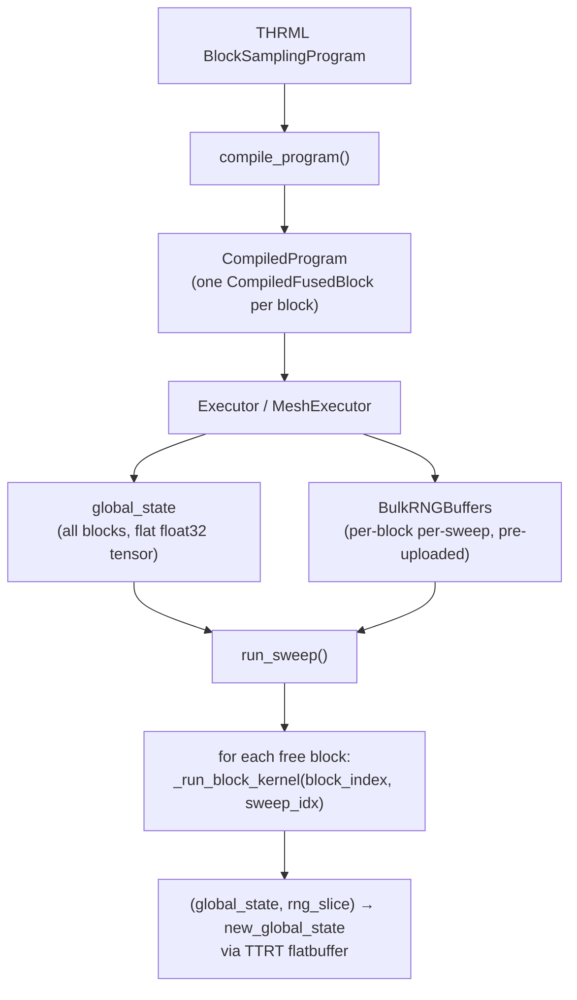
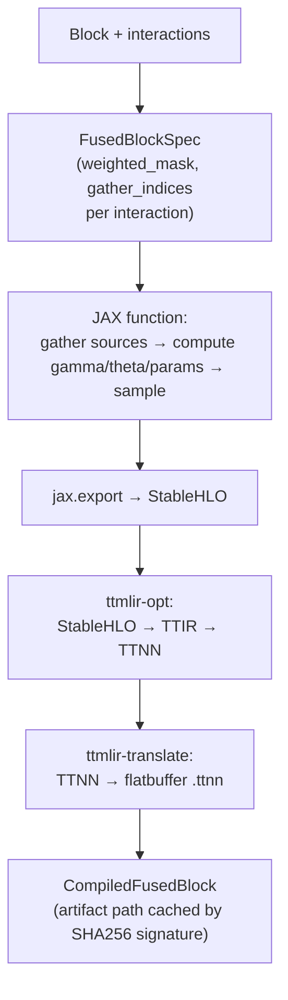
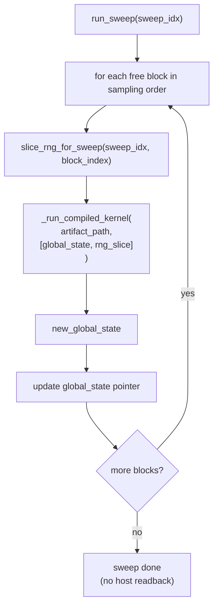

# TT-THRML Internals

`tt-thrml` has one simple boundary:

- upstream `thrml` owns program authoring
- `tt-thrml` owns Tenstorrent execution

The executor compiles each block once to a fused TT-MLIR flatbuffer kernel, keeps all block states concatenated in a single on-device tensor, and runs sweeps by invoking each kernel with a pre-uploaded RNG slice.

## Architecture



## Compilation

Each THRML block is compiled to a single flatbuffer that fuses all of its interactions.



## Sweep Flow



## Kernel Structure (per family)

Each fused kernel takes `(global_state, rng_slice)` and returns `new_global_state`. All interaction math, sampling, and state update happen inside the flatbuffer.

**Spin:**
```
gather source states from global_state
compute gamma = sum(weights * source_states)
new_state = where(2*gamma > rng_logistic, +1, -1)
scatter new_state into global_state slice
```

**Categorical:**
```
gather source states from global_state
compute log_theta[k] = sum(weights[k] * source_states)
new_state = argmax(log_theta + rng_gumbel)
scatter new_state into global_state slice
```

**Gaussian:**
```
gather source states from global_state
compute linear = sum(weights * source_states)
compute precision = sum(reciprocal(inverse_weights) * source_states)
variance = 1 / precision
mean = linear * variance
new_state = mean + sqrt(variance) * rng_normal
scatter new_state into global_state slice
```

## RNG Contract

Bulk RNG is pre-generated on the host and uploaded once per `sample_with_observation` call. Each sweep consumes one slice per block by index — no per-sweep uploads in the hot path.

Key derivation mirrors THRML's `sample_with_observation` exactly:

```
(sample_key, warmup_key) = split(root_key)

warmup sweeps:  split(warmup_key, n_warmup)[sweep_i]
sample sweeps:  split(split(sample_key, n_samples-1)[outer], steps_per_sample)[inner]

per_block_keys = split(sweep_key, n_free_blocks)
block_rng_key  = split(per_block_keys[block_index])[0]
```

This gives sample-by-sample parity with upstream THRML on the JAX reference path.

## Global State Layout

All blocks are concatenated into one flat `float32` tensor:

```
[block_0_nodes | block_1_nodes | ... | block_n_nodes]
   n_nodes[0]     n_nodes[1]           n_nodes[n]
```

- Free blocks come first, clamped blocks after.
- Spin states are stored as `±1.0`.
- Categorical states are stored as the integer category index cast to `float32`.
- Gaussian states are stored directly as `float32`.

## Device Ownership

- TTNN devices passed in by the caller stay caller-owned.
- `MeshDevice`s passed in by the caller stay caller-owned.
- Executors borrow those devices; they do not close them.
- TT-MLIR runtime sessions opened internally are owned and closed by `tt-thrml`.
