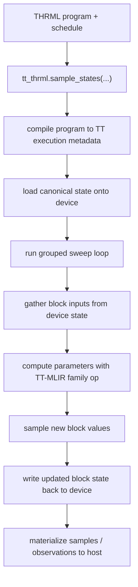

# tt-thrml Internals

This is the whole idea in one sentence:

`thrml` defines the probabilistic program; `tt-thrml` runs its grouped sampling loop on TT hardware.

## Mental Model

- upstream `thrml` owns authoring
- `tt-thrml` owns execution
- TT-MLIR owns parameter-kernel math
- TTNN owns device/runtime state and execution plumbing

So `tt-thrml` is not a second authoring library. It is an execution layer.

## Execution Flow

## What Stays Where

TT-MLIR is used for the parameter-math part of sampling:

- spin -> gamma
- categorical -> theta
- gaussian -> canonical parameters

`tt-thrml` keeps the runtime parts:

- grouped sweep ordering
- device-resident state
- RNG splitting
- buffered writes at group boundaries
- sampler-state updates
- observation and host readback

That split is the core design choice in this repo.

## Supported Shape

The supported execution surface today is the THRML sampling path:

- spin
- categorical
- gaussian
- mixed sampling programs built from those families

Custom samplers and interactions can work when they lower cleanly onto that execution model.
The unsupported part today is the upstream training / moment-estimation side, not the core
sampling runtime.

## Multi-Device

There is a multi-device path through TT `MeshDevice`.

Today that means:

- one process
- explicit TT mesh placement/composition
- a clean executor boundary for multi-device work

It does not yet mean a fully sharded multi-Wormhole sweep engine.
